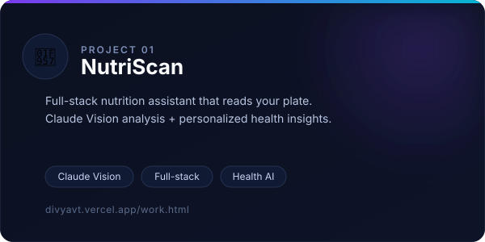
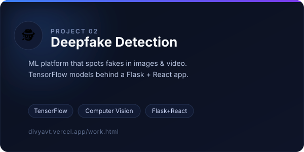
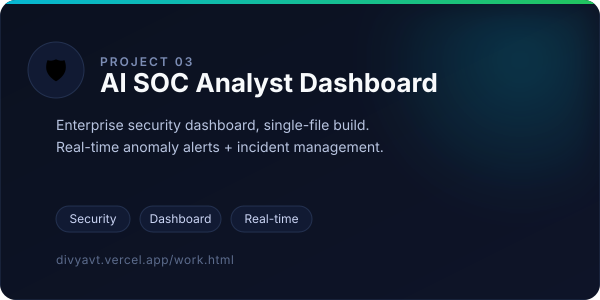
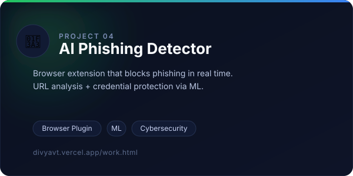
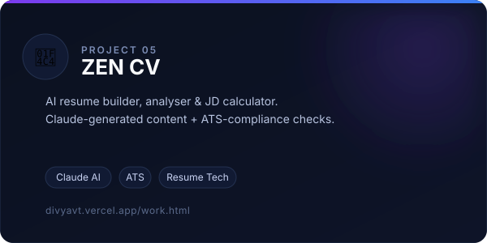
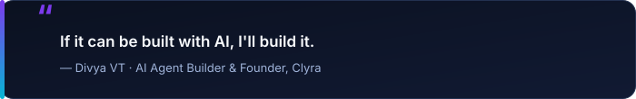

<!--
  DIVYA VENKATACHALAM T — GITHUB PROFILE README
  Design system: dark, minimal, gradient-accented (Apple/Linear/Vercel inspired)
  Palette → bg #0B1120 · primary #7C3AED · secondary #3B82F6 · accent #06B6D4 · success #22C55E · text #F8FAFC
  See SETUP.md for every placeholder you need to replace before this goes live.
-->

<div align="center">

<!-- ============================= HERO ============================= -->


<br/>

<a href="https://git.io/typing-svg">
  
</a>

<br/><br/>

<a href="https://divyavt.vercel.app">
  
</a>
<a href="https://linkedin.com/in/divyavt">
  
</a>
<a href="mailto:vtdivya202006@gmail.com">
  
</a>
<a href="https://github.com/divyacodespace">
  
</a>
<a href="./assets/resume.pdf">
  
</a>

</div>


<!-- ============================= INTRODUCTION ============================= -->
### 01 · Introduction

I'm **Divya Venkatachalam T**, a final-year **Computer Science** student also studying
**Data Science at IIT Madras** — obsessed with turning large language models into agents
that do real work. I've shipped everything from a **Claude Vision–powered nutrition app**
to a **TensorFlow deepfake detector**, wiring model, backend, and frontend together end to end.

In 2025 I founded **Clyra**, an MSME-registered services + edutech startup, where I build
AI products for clients and teach the next wave of builders. Off the keyboard, I lead a
**50+ member media club** as President and pick up the occasional paper-presentation win.

```txt
role        → GenAI Engineer · Founder @ Clyra
focus       → AI Agents · LLM Integration (Claude / OpenAI) · Computer Vision
studying    → B.E. CSE @ Gnanamani College of Technology (CGPA 9.0)
              B.S. Data Science & Applications @ IIT Madras
principle   → if it can be built with AI, I'll build it
```


<!-- ============================= TECH STACK ============================= -->
### 02 · Stack

<table width="100%">
<tr><td>

**🤖 GenAI & LLM Frameworks**


    

</td></tr>
<tr><td>

**🧠 Machine & Deep Learning**


  

</td></tr>
<tr><td>

**🎨 Frontend Development**


 

</td></tr>
<tr><td>

**📊 Data Science & Analytics**


     

</td></tr>
<tr><td>

**⚙️ Backend & Databases**


 

</td></tr>
<tr><td>

**🛠️ Tools & Version Control**


 

</td></tr>
</table>


<!-- ============================= FEATURED PROJECTS ============================= -->
### 03 · Featured Projects

<table width="100%">
<tr>
<td width="50%" valign="top">
<a href="https://divyavt.vercel.app/work.html">

</a>

**🥗 NutriScan**
Full-stack nutrition assistant that reads your plate — analyzes food images with the Claude Vision API and returns personalized dietary recommendations and health insights.

`Claude Vision` `Full-stack` `Health AI`

[Case Study](https://divyavt.vercel.app/work.html) · [Source](https://github.com/divyacodespace/PROJECT_REPO)

</td>
<td width="50%" valign="top">
<a href="https://divyavt.vercel.app/work.html">

</a>

**🕵️ Deepfake Detection Platform**
ML platform that spots fakes in images & video — TensorFlow deep-learning models behind a Flask backend and React frontend for real-time analysis.

`TensorFlow` `Computer Vision` `Flask + React`

[Case Study](https://divyavt.vercel.app/work.html) · [Source](https://github.com/divyacodespace/PROJECT_REPO)

</td>
</tr>
<tr>
<td width="50%" valign="top">
<a href="https://divyavt.vercel.app/work.html">

</a>

**🛡️ AI SOC Analyst Dashboard**
Single-file enterprise security dashboard with threat-detection UI, real-time anomaly alerts, and incident management — wrapped in a premium dark cybersecurity aesthetic.

`Security` `Dashboard` `Real-time`

[Case Study](https://divyavt.vercel.app/work.html) · [Source](https://github.com/divyacodespace/PROJECT_REPO)

</td>
<td width="50%" valign="top">
<a href="https://divyavt.vercel.app/work.html">

</a>

**🎣 AI Phishing Detector**
Browser extension powered by ML that detects and blocks phishing sites in real time — URL analysis, credential protection, and suspicious-pattern recognition with friendly alerts.

`Browser Plugin` `ML` `Cybersecurity`

[Case Study](https://divyavt.vercel.app/work.html) · [Source](https://github.com/divyacodespace/PROJECT_REPO)

</td>
</tr>
<tr>
<td width="50%" valign="top">
<a href="https://divyavt.vercel.app/work.html">

</a>

**📄 ZEN CV**
AI resume builder, analyser & JD calculator — uses Claude for content generation, ATS-compliance checks, industry templates, and real-time skill suggestions.

`Claude AI` `ATS` `Resume Tech`

[Case Study](https://divyavt.vercel.app/work.html) · [Source](https://github.com/divyacodespace/PROJECT_REPO)

</td>
<td width="50%" valign="top"></td>
</tr>
</table>

<div align="center"><sub>Thumbnails are custom-built cards (<code>assets/images/</code>) — swap in real product screenshots any time, and case-study links to direct GitHub repo links once you've picked which repos to make public. See SETUP.md.</sub></div>


<!-- ============================= AI EXPERTISE TIMELINE ============================= -->
### 04 · AI Expertise

<table width="100%">
<tr><td width="4%" align="center">💬</td><td width="20%"><b>Prompt Engineering</b></td><td>Structured prompting and system-prompt design for production Claude / OpenAI integrations</td></tr>
<tr><td align="center">🤖</td><td><b>AI Agent Development</b></td><td>Building autonomous agents for real task execution — shipped in production during a GenAI internship</td></tr>
<tr><td align="center">👁️</td><td><b>Computer Vision</b></td><td>TensorFlow deep-learning models for detection tasks — deepfake detection, image analysis</td></tr>
<tr><td align="center">🔌</td><td><b>LLM Integration</b></td><td>Wiring the Claude API and OpenAI APIs into full-stack products end to end</td></tr>
<tr><td align="center">📊</td><td><b>Model Evaluation</b></td><td>Assessing model output quality and reliability across shipped projects</td></tr>
<tr><td align="center">🔁</td><td><b>Workflow Automation</b></td><td>Automation & dashboards as part of Clyra's AI services offering</td></tr>
</table>


<!-- ============================= GITHUB ANALYTICS ============================= -->
### 05 · GitHub Analytics

<div align="center">


<!-- Contribution snake — generated by .github/workflows/snake.yml, see SETUP.md -->


</div>


<!-- ============================= CURRENT FOCUS ============================= -->
### 06 · Current Focus

- 🤖 **Building** — AI agents with the Claude API as part of my GenAI internship at DataReveal AI
- 🔐 **Researching** — post-quantum security algorithms and quantum-safe cryptography
- 🎓 **Teaching** — AI, ML & prompt engineering through Clyra's EduTech arm
- 🚀 **Working on** — Clyra's next client product, from agent design to deployment
- 🎤 **Leading** — a 50+ member media club as President


<!-- ============================= ACHIEVEMENTS ============================= -->
### 07 · Achievements

<br/>

**🎓 Education**

<table width="100%">
<tr><td width="4%" align="center">🏫</td><td width="30%"><b>B.S. Data Science &amp; Applications</b></td><td>Indian Institute of Technology, Madras · <i>2024–2028 (2nd Year)</i></td></tr>
<tr><td align="center">🏛️</td><td><b>B.E. Computer Science &amp; Engineering</b></td><td>Gnanamani College of Technology · CGPA 9.0 · <i>2023–2027 (Final Year)</i></td></tr>
</table>

**🏢 Experience**

<table width="100%">
<tr><td width="4%" align="center">🤖</td><td width="30%"><b>GenAI Intern — DataReveal AI</b></td><td>Built &amp; deployed AI agents with the Claude API; worked on cybersecurity threat analysis and post-quantum security research · <i>Mar 2026 – Aug 2026, Remote</i></td></tr>
<tr><td align="center">💻</td><td><b>SDE Intern — Bluestock</b></td><td>Developed and optimized backend features with Java, Python &amp; REST APIs for real-time financial data apps · <i>Aug 2025 – Sep 2025, Bengaluru</i></td></tr>
<tr><td align="center">🗄️</td><td><b>ERP Intern — Visteria</b></td><td>ERP module development, database integration, UI enhancements · <i>Jun 2025, Chennai</i></td></tr>
</table>

**🏆 Wins**

<table width="100%">
<tr><td width="4%" align="center">🥈</td><td width="30%"><b>Regional Pre-Finalist</b></td><td>ICT Academy Youth Talk 2025 — Top 105 among 21,000+ participants</td></tr>
<tr><td align="center">☁️</td><td><b>ELITE Certified — IoT &amp; Cloud Computing</b></td><td>NPTEL</td></tr>
<tr><td align="center">⚡</td><td><b>Salesforce Agentforce Specialist</b></td><td>Data Cloud &amp; Prompt Templates</td></tr>
<tr><td align="center">🥇</td><td><b>Overall Performer &amp; CSE Topper</b></td><td>Academic year 2024–2025</td></tr>
<tr><td align="center">🎤</td><td><b>Multiple Presentation Wins</b></td><td>Across paper &amp; project presentations</td></tr>
</table>

**👥 Leadership**

<table width="100%">
<tr><td width="4%" align="center">🎬</td><td width="30%"><b>President — Social Media Club</b></td><td>Leading 50+ members across content, media &amp; branding initiatives · <i>Jul 2025 – Present</i></td></tr>
<tr><td align="center">🎥</td><td><b>Vice President — Social Media Club</b></td><td>Directed social strategy, mentored the content team · <i>Mar 2024 – Jun 2025</i></td></tr>
<tr><td align="center">🤝</td><td><b>Student Coordinator</b></td><td>Bridged student teams with leadership on media initiatives · <i>Nov 2023 – Mar 2025</i></td></tr>
</table>


<!-- ============================= CONNECT ============================= -->
### 08 · Connect

<div align="center">

<a href="https://github.com/divyacodespace"></a>
<a href="https://linkedin.com/in/divyavt"></a>
<a href="mailto:vtdivya202006@gmail.com"></a>
<a href="https://divyavt.vercel.app"></a>
<a href="https://instagram.com/techwithclyra"></a>
<a href="https://divyavt.vercel.app/clyra.html"></a>

</div>


<!-- ============================= FOOTER ============================= -->
<div align="center">



<br/>


&nbsp;


<br/><br/>

<sub>Made with ❤️ by Divya Venkatachalam T</sub>


</div>
